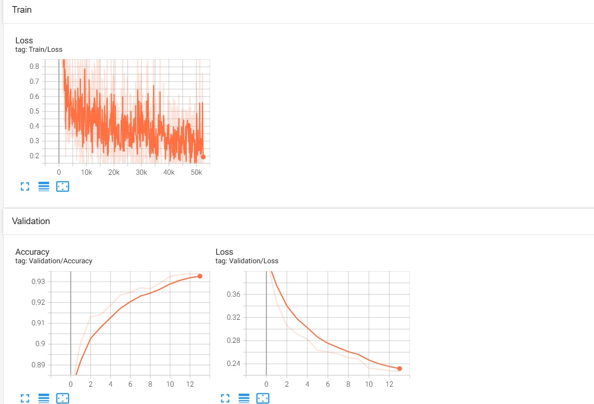

 <h1 align="center">QuickDraw - Google</h1>

## Introduction

QuickDraw is a Python-based application inspired by Google's popular online game. This project provides an interactive way to draw objects using either a camera or a canvas.
The app detects movements in real-time and translates them into digital sketches. With my implementation, you can:

Draw in front of a camera using your finger.
Follow the instructions on the webcam to operate

## Camera app
After turning on the webcam, to use it, use your index finger to move and draw images according to the instructions:
* Press C to delete drawings.
* Press D to turn on/off drawing
* Press A to change challenges
* Press P key to identify what you are drawing

   
  <i>Demo</i>

## Dataset
 The dataset you can find at this link :[Quick Draw dataset] https://console.cloud.google.com/storage/browser/quickdraw_dataset/sketchrnn. I picked up 15 files for 15 classes to train my model

## Classes:
"Airplane"      "Angel"
"Apple"         "Axe" 
"Bat"           "Book"
"Boomerang"     "Camera"
"Cup"           "Fish" 
"Flower"        "Mushroom"
"Radio"         "Sun" 
"Sword"

## Trained models

You could find my trained model at **train_model_QuickDraw/quickdraw**

## Training

To train the model, download the .npz files corresponding to the 15 categories used and save them in the data folder. 
If you'd like to train the model with a different set of categories, simply update the CLASSES constant in the src/config.py file and download the appropriate .npz files. 
After setting this up, you can start training by running the command:

python train_Quick_Draw.py

## Accuracy/ Loss

 

## Requirements

* **python**
* **cv2**
* **pytorch** 
* **numpy**
